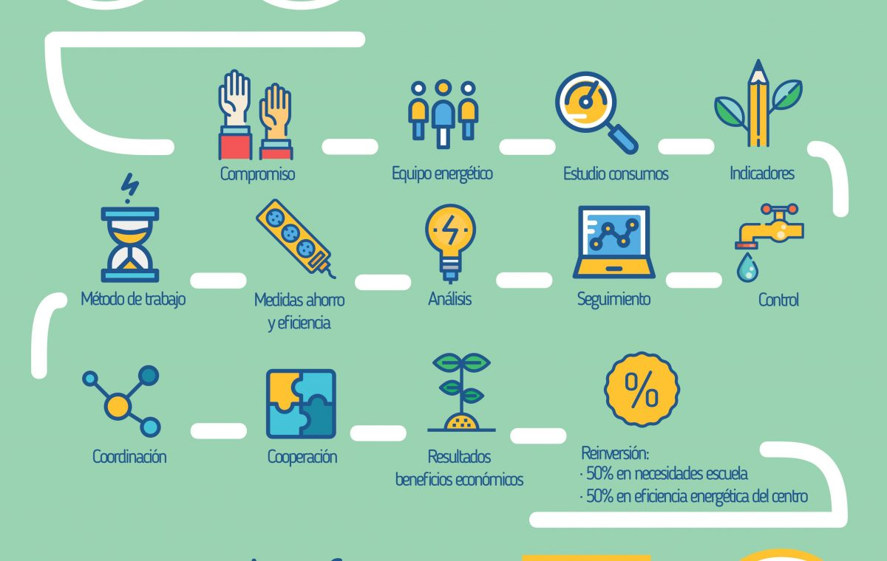

# Monitorizacion ecooolocal
 
 

 
 

 
## Colegios con sistemas de medida de energía

Este proyecto tiene como objetivo proporcionar una herramienta de ahorro energético a los alumnos de colegios que esten participando en proyectos de sensibilización energética.
El proyecto se desarrolla en el marco de Software Libre y por lo tanto todos los programas estan en el dominio público

## Centros educativos
Esta es la relación de centros educativos que disponen de la medida de energía:

* [Elizalde Herri Eskola (Oiartzun) ](http://91.121.157.131/emoncms/dashboard/view?id=41)

* [Lezoko Herri Eskola (Lezo) ](http://91.121.157.131/emoncms/dashboard/view?id=58)

* [Karmengo Ama Herri Eskola (Pasaia) ](http://91.121.157.131/emoncms/dashboard/view?id=42)

* [Mare de Déu del Carme (Maó) ](http://91.121.157.131/emoncms/dashboard/view?id=62)

* [Maria Lluïsa Serra (Maó) ](http://91.121.157.131/emoncms/dashboard/view?id=67)

* [Gamón Ikastetxea (Errenteria) ](https://app.energomonitor.cz/login?next=/)

* [Colegio Ártica- Madrid ](http://data.endef.com/emoncms/dashboard/view?id=72)

## La monitorización de los colegios
La visualización de los datos es de fácil comprensión y muestra la comparación del consumo energético del centro en diferentes periodos de tiempo. 

Los datos energéticos de los colegios se presentan de la siguiente forma:

* Menú principal
    * electricidad 
    * gas
    * gasoil
    * agua
    
* Menú secundario:
    * Anual 
    * Mensual
    * Semanal 
    * Diario

* Características de la página:
    * Inicialmente muestra dos gráficas para comparar consumos. 
    * La pantalla inferior será inicialmente igual a la superior
    * Se puede ver el consumo total representado en cada una de las gráficas
    * Las lecturas tienen un detalle que llega a los 5 minutos
    * El día es la máxima división
    * Se pueda elegir una semana, o cualquier otro intervalo, de forma sencilla
    * Es posible visualizar el ultimo mes incluido el último día del mes en curso
    * También se puede seleccionar el año
    * En las gráficas se incluye un sensor externo de temperatura exterior
    
* Las unidades de medida representadas en las gráficas son:
    * Electriciada: kWh
    * Gas: kWh
    * Gasoil: litros
    * Agua: m3
